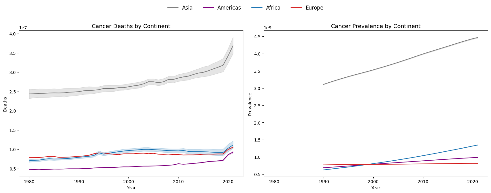

# [TCRGoogle: An Explainable Generative Framework for T-Cell Receptor Specificity Prediction](https://github.com/TengyaoTu/TCRGoogle)


The number of cancer cases continues to rise globally, highlighting an urgent need for effective and innovative treatments. Among these, cell-based immunotherapies—such as T-cell receptor (TCR) engineering—have emerged as a promising and timely solution to combat cancer with greater precision and personalization.

We propose a three-stage framework, TCRGoogle, designed for T-cell receptor (TCR) specificity prediction. This framework integrates efficient retrieval, rigorous similarity evaluation, and adaptive sequence generation to provide accurate, interpretable, and scalable predictions of TCR-epitope interactions. By combining knowledge-based searching with generative modeling, TCRGoogle enables both fast matching and hypothesis generation for novel TCR sequences, addressing key challenges in personalized immunotherapy development.


## Requirements
TEPCAM is constructed using python 3.8.16. The detail dependencies are recorded in `requirements.txt`.    

To install from the [requirements.txt](requirements.txt), using:     

```bash
pip install -r requirements.txt
```   

Using a conda virtual environment is highly recommended.

``` console
conda create -f env.yaml
```

## TCRGoogle Using
```bash
python TCRGoogle_Run.py \
--cdr3 "CASSIVGGNEQFF" \
--model "QuantFactory/Bio-Medical-Llama-3-8B-GGUF"


