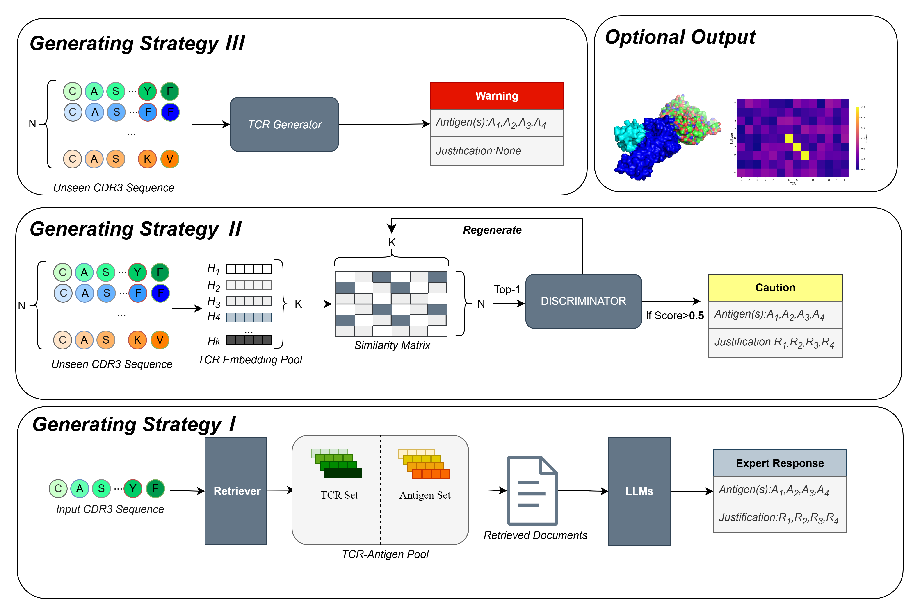

# [TCRGoogle: An Explainable Generative Framework for T-Cell Receptor Specificity Prediction](https://github.com/TengyaoTu/TCRGoogle)
Implementation of TEPCAM, a binary classification model for TCR-beta-CDR3 and epitope.     
This repository contains processed data, code and checkpoint.



## Requirements
TEPCAM is constructed using python 3.8.16. The detail dependencies are recorded in `requirements.txt`.    

To install from the [requirements.txt](requirements.txt), using:     

```bash
pip install -r requirements.txt
```   

Using a conda virtual environment is highly recommended.

``` console
conda create -f env.yaml
```

## Model Training
```bash
python TCRGoogle_Run.py \
--cdr3 "CASSIVGGNEQFF" \
--model "QuantFactory/Bio-Medical-Llama-3-8B-GGUF"


